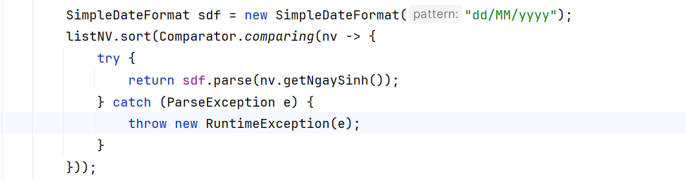
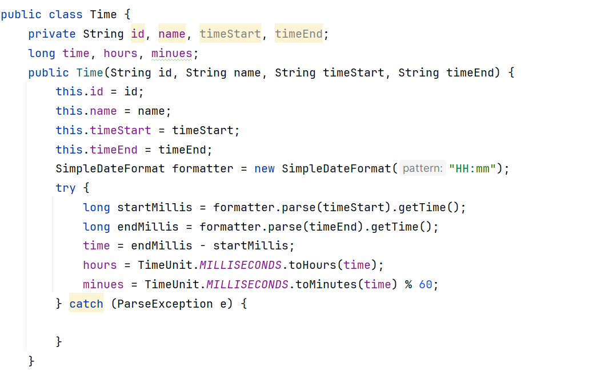
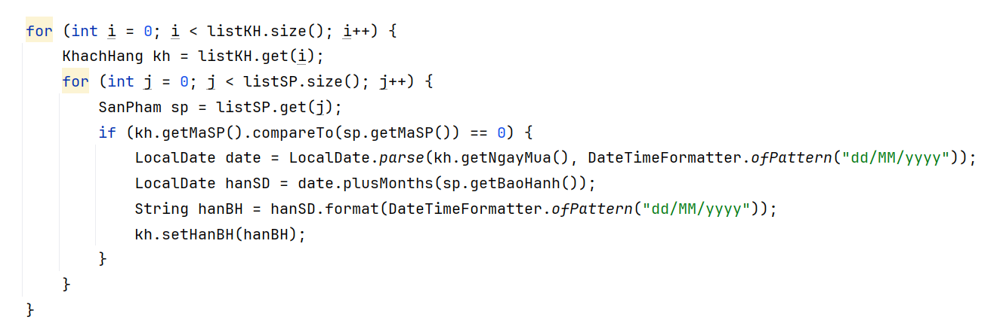
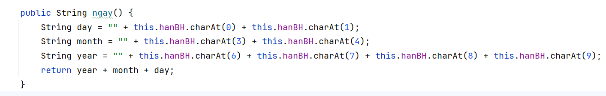
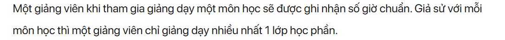
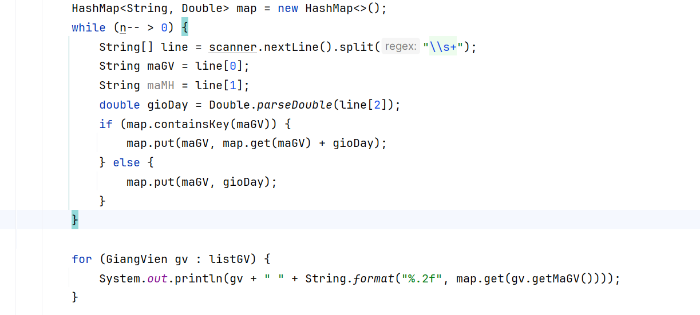
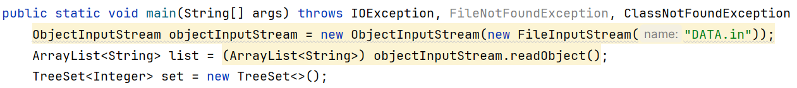
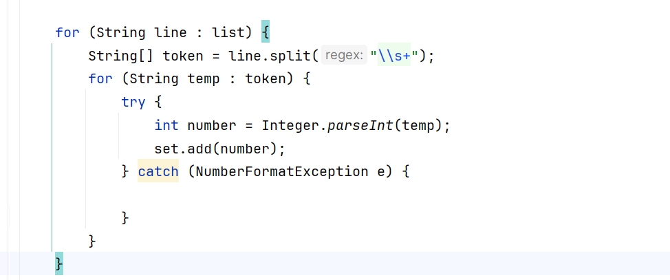

# 1. J05007 SẮP XẾP DANH SÁCH ĐỐI TƯỢNG NHÂN VIÊN
#### Định dạng ngày tháng theo đầu bài là dd/mm/yyyy, do vậy sử dụng trực tiếp sort (ArrayList) sẽ không phù hợp
#### Giải pháp là chuẩn hóa theo SimpleDateFormat

# 2. J05011 TÍNH GIỜ
#### Bài này yêu cầu xử lý thời gian phải thật chuẩn, không sẽ bị WA, IR ngay
#### Giải pháp là chuẩn hóa theo SimpleDateFormat

#### Tạo ra 3 biến kiểu long là time, hours, minues (Bắt buộc phải là long), sau đó xử lý try catch
#### hours và minues có thể đổi về theo TimeUnit.MILLISECONDS.toHours, minues = TimeUnit.MILLISECONDS.toMinutes hoặc lấy time / 1000 (1s = 1000 millis second)
#### Nếu bài yêu cầu sort thì sẽ sort theo biến time
# 3. J07049 TÍNH NGÀY HẾT HẠN BẢO HÀNH	
#### Bài này cũng yêu cầu xử lý thời gian (hết hạn)
#### Có thể dùng LocalDate để xử lý

#### Cách tối ưu để đỡ phải xử lý nhiều là tạo một biến String HanBH, rồi lồng 2 for để tìm ra sản phẩm, sau đó setHanBH là xong
#### Bước cuối thì phải đổi ngày về String mới so sánh được (Hoặc làm giống 1 dùng SimpleDateFormat)

# 4. J07028 TÍNH GIỜ CHUẨN
#### Bài này phải xử lý đến trường hợp: Một giảng viên sẽ có thể dạy nhiều môn

#### Giải pháp là dùng HashMap để ánh xạ Mã GV - Số giờ dạy

# 5. KT1 - THOOP lần 3
#### Bài này đọc từ file nhị phân vào, sau đó list ra danh sách (không trùng nhau) kiểu INT
#### Yêu cầu xử lý:

#### ObjectInputStream, ArrayList để đọc file nhị phân vào lưu vào ArrayList
#### TreeSet để lưu danh sách số 
#### Tách số bằng regex và xử lý ngoại lệ khi chuyển từ kiểu string sang int
